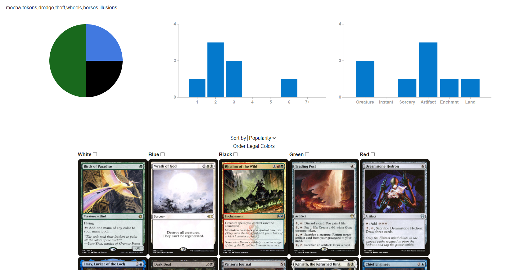

# ElderDraft
The published version of this site can be viewed here: https://thatsgerman.github.io/ElderDraft/

Elder Draft is a blazor website to draft Commander for Magic the Gathering and export drafts and constructed decks to Tabletop Simulator.

A draft is generated by combining 4 themes and 2 tribes and generating a card pool from those themes/tribes.
The card pool is based on the cards from the corresponding EDHRec.com page on the theme/tribe, this is pregenerated and pulled from the "big_data" folder.
The card images are pulled from Scryfall's API.
This is a bot draft, the bots will look for a commander and then choose cards in their color identity with the highest "edhrec_score" from Scryfall.
If no cards are in their color, they will choose the cards with the highest "edhrec_score", after testing the bots are reasonable drafting buddies.
Constructed decks and draft decks can be copied to carry over to your favorite deck building site, or downloaded to be imported into Tabletop Simulator.

Elder Draft uses different rules on rarity compared to traditional draft, instead of having a number of rares, uncommons, and commons, the rarity of the cards is completely random.
After testing we found that traditional drafting rarity rules lead to stalled games that were not enjoyable, as most sweepers are rare.
There is also a Commander Legend's draft that is also available.
